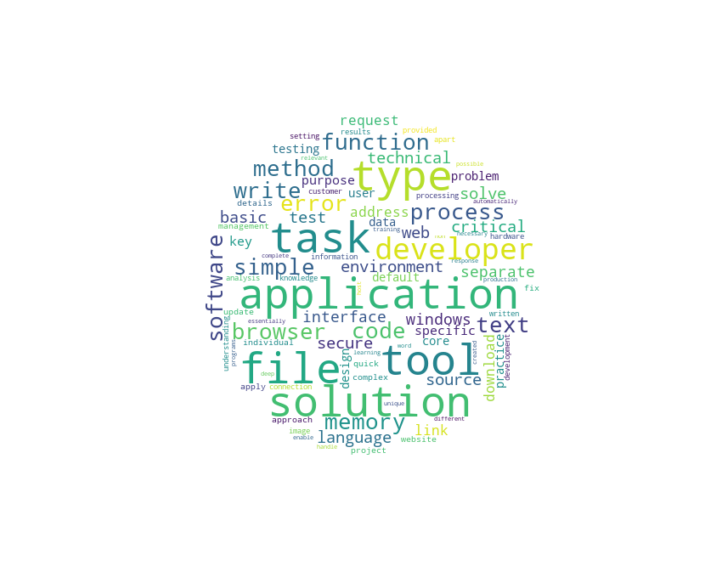

<h1 align="center">PVTM</h1>
<p align="center">Paragraph Vector Topic Model</p>

**PVTM** represents documents in a semantic space via [Doc2Vec](https://arxiv.org/abs/1405.4053/) to cluster them into meaningful topics using [Gaussian mixture models](https://link.springer.com/referenceworkentry/10.1007%2F978-1-4899-7488-4_196) (GMM). Doc2Vec has been shown to capture latent variables of documents, e.g., the underlying topics of a document. Clusters of documents in the vector space can be interpreted and transformed into meaningful topics by means of Gaussian mixture modeling.

<h2 align="center">Highlights</h2>

-  :speech_balloon: **Easily identify latent topics in large text corpora** 
-  :chart_with_upwards_trend: **Detect trends and measure topic importance over time** 
-  :bar_chart: **Identify topics in unseen documents** 
-  :telescope: **Built-In text preprocessing** 

<h2 align="center">Install</h2>

Via `pip` 

```
[comment]: <> (pip install git+https://github.com/davidlenz/pvtm)
git clone https://github.com/davidlenz/pvtm
cd pvtm
pip install -r requirements.txt
```

<h2 align="center">Getting Started</h2>
<h3 align="center">Importing & Preprocessing documents</h3>

Once **PVTM** is installed, analysis on text documents can be conducted.
The example below considers texts from different online news, the data can be loaded as follows

```python
from pvtm import pvtm
texts = pvtm.load_example_data()
```
`PVTM` object takes a list of strings as input.
`.preprocess` method offers the possibility to clean (e.g. removal of special characters, number, currency symbols etc.) and lemmatize these strings.
Parameter `lemmatize` should be set to `True` when documents' texts should be lemmatized. This can lead to improved results but also may take some time depending on the size of the corpus. 
If the texts should be lemmatized first, corresponding language models should be downloaded from [here](https://spacy.io/usage/models/) and the language parameter should be set, e.g. `lang='en'`. 
With the parameters `min_df` and `max_df` the thresholds for very rare/common words, which should not be included in the corpus specific vocabulary, can be set. Further, language specific stopwords can be excluded by importing your own stopwords list or, for axample, using nlkt library.  

```python
p = PVTM(texts)
_ = pvtm.preprocess(lemmatize = True, lang = 'en', min_df = 0.005)
```

<h2 align="center">Training</h2>

The next step includes training the Doc2Vec model and clustering of the resulted document vectors by means of Gaussian mixture modeling. The `pvtm.fit()` method should be called and the [parameters](https://github.com/davidlenz/pvtm#parameters) needed for the Doc2Vec model training and GMM clustering should be passed. For more detailed description of the parameters see information provided [on the gensim Doc2Vec documentation](https://radimrehurek.com/gensim/models/doc2vec.html)(Doc2Vec model) and [sklearn for the Gaussian mixture model](https://scikit-learn.org/stable/modules/generated/sklearn.mixture.GaussianMixture.html)(GMM).

```python
p.fit(vector_size = 50, # dimensionality of the feature vectors (Doc2Vec)
         n_components = 20, # number of Gaussian mixture components, i.e. Topics (GMM)
         epochs=30)
```

<h2 align="center">Visualize topics</h3>

The words closest to a topic center vector are considered as topic words. You can visualize topic words with a wordcloud:

```python
p.wordcloud_by_topic(0)
```

  
  


<h2 align="center">Parameters</h2>


| param        | default | description                                                                                        |
|--------------|-------|----------------------------------------------------------------------------------------------------|
| vector_size            | 300     | dimensionality of the feature vectors (Doc2Vec)                                        |
| n_components            | 15     | number of Gaussian mixture components, i.e. Topics (GMM)                                        |
| hs           | 0     | negative sampling will be used for model training (Doc2Vec)                                        |
| dbow_words   | 1     | simultaneous training of word vectors and document vectors (Doc2Vec)                               |
| dm           | 0     | Distributed bag of words (word2vec-Skip-Gram) (dm=0) OR distributed memory (dm=1)                  |
| epochs       | 1     | training epochs (Doc2Vec)                                                                          |
| window       | 1     | window size (Doc2Vec)                                                                              |
| seed         | 123   | seed for the random number generator (Doc2Vec)                                                     |
| min_count    | 5     | minimal number of appearences for a word to be considered (Doc2Vec)                                |
| workers      | 1     | number workers (Doc2Vec)                                                                           |
| alpha        | 0.025 | initial learning rate (Doc2Vec)                                                                    |
| min_alpha    | 0.025 | doc2vec final learning rate. Learning rate will linearly drop to min_alpha as training progresses. |
| random_state | 123   | random seed (GMM)                                                                                  |
| covarinace_type  | 'diag' | covariance type (GMM)                                                    |
| save | True   | save the trained model                                                                                  |
| filename | 'pvtm_model' | name of the model to be saved |


`p.topic_words`contains 100 frequent words from the texts which were assingned to single topics. 
`p.wordcloud_df`contains all texts which were assingned to single topics. 


<h2 align="center">Best matching topics</h2>

`search_topic_by_term` method allows to search for topics which best describe defined term(s). For example,

```python
p.search_topic_by_term(['deal'])
p.search_topic_by_term(['chance','market'])
```
return:
```text
best_matching_topic 2
best_matching_topic 14
```
  

<h2 align="center">PVTM Web Viewer</h2>

For visualization of your results, one can run a [dash app](https://dash.plot.ly/) which allows to explore detected topics in the browser interactively. PVTM includes a web app build on dash to visualize results. 

```python
p.start_webapp()
```
One can see the link in the new CMD window: 


And all results can be viewed in the browser: 


<h2 align="center">Inference (*experimental*)</h2>

PVTM allows you to easily estimate the topic distribution for unseen documents using `.infer_topics()`. This methods explicitly calls `.get_string_vector`(getting a vector from the input text) and `.get_topic_weights`(probability distribution over all topics) consecutively.  

```python
topics = p.infer_topics(new_text)
```

which returns:

```text
array([1.56368593e-06, 6.37091895e-10, 3.80703376e-04, 5.03966331e-06,
       1.42747313e-06, 1.67904347e-06, 4.88286876e-03, 2.65966754e-04,
       2.36464245e-05, 1.11277397e-02, 1.75574895e-05, 1.65568283e-04,
       1.86956832e-08, 5.60976912e-07, 2.58802897e-02, 2.47131308e-05,
       7.21725620e-08, 1.10484111e-02, 9.46138567e-01, 3.36056592e-05])
```


<h2 align="center">Troubleshooting</h2>

If you get the following warning message during model training:

|:warning: **User Warning**: C extension not loaded, training will be slow. Install a C compiler and reinstall gensim for     fast training. "C extension not loaded, training will be slow."|
| --- |

just run:

```
conda install -c conda-forge gensim
```
