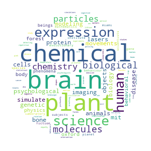

<h1 align="center">PVTM</h1>
<p align="center">Paragraph Vector Topic Model</p>

**PVTM** represents documents in a semantic space via [Doc2Vec](https://arxiv.org/abs/1405.4053/) to cluster them into meaningful topics using [Gaussian mixture models](https://link.springer.com/referenceworkentry/10.1007%2F978-1-4899-7488-4_196) (GMM). Doc2Vec has been shown to capture latent variables of documents, e.g., the underlying topics of a document. Clusters of documents in the vector space can be interpreted and transformed into meaningful topics by means of Gaussian mixture modeling.

<h2 align="center">Highlights</h2>

-  :speech_balloon: **Easily identify latent topics in large text corpora** 
-  :chart_with_upwards_trend: **Detect trends and measure topic importance over time** 
-  :bar_chart: **Identify topics in unseen documents** 
-  :telescope: **Built-In text preprocessing** 

<h2 align="center">Install</h2>

Via `pip` 

```
pip install pvtm 
```

<h2 align="center">Getting Started</h2>
<h3 align="center">Importing & Preprocessing documents</h3>

Once you have installed **PVTM**, you can conduct analysis on your text documents.
The example below considers texts from different online news, you can load the data as follows

```python
from pvtm.pvtm import PVTM
texts = PVTM.load_example_data()
```
After that, `PVTM` object should be created with the defined input texts.
Parameter `lemmatized` should be set to `False` when documents' texts should be lemmatized. However, take into account that this step could lead to improved results but also takes some time depending on the size of the document corpus. If you want to lemmatize your texts, you should first download [language models](https://spacy.io/usage/models/) and set the parameter lang, e.g. `lang='en'`. 
Set the parameter `preprocess=True` when the documents texts should be preprocessed, e.g. removal of special characters, number, currency symbols etc.
With the parameters `min_df` and `max_df` you set the thresholds for very rare/common words which should not be included in the corpus specific vocabulary. Further, you can also exclude language specific stopwords by importing your own stopwords list or using nlkt library as shown below.  

```python
from pvtm.pvtm import clean
import nltk
from nltk.corpus import stopwords 
stop_words = set(stopwords.words('english') + ['reuter', '\x03'])
stop_words = list(stop_words)
pvtm = pvtm.PVTM(texts, lemmatized = True, stopwords=stop_words)
```

<h2 align="center">Training</h2>

The next step includes training the Doc2Vec model and clustering of the resulted document vectors by means of Gaussian mixture modeling. Call the `pvtm.fit()` method and pass the [parameters](https://github.com/davidlenz/pvtm#parameters) needed for the Doc2Vec model training and GMM clustering. For more detailed description of the parameters see information provided [on the gensim Doc2Vec documentation](https://radimrehurek.com/gensim/models/doc2vec.html)(Doc2Vec model) and [sklearn for the Gaussian mixture model](https://scikit-learn.org/stable/modules/generated/sklearn.mixture.GaussianMixture.html)(GMM).

```python
pvtm.fit(n_components = 20, vector_size = 30)
```

<h2 align="center">Visualize topics</h3>

The words closest to a topic center vector are considered as topic words. You can visualize topic words with a wordcloud:

```python
pvtm.wordcloud_by_topic(0)
pvtm.wordcloud_by_topic(5)
pvtm.wordcloud_by_topic(16)
```





<h3 align="center">Parameters</h3>


| param        | default | description                                                                                        |
|--------------|-------|----------------------------------------------------------------------------------------------------|
| vector_size            | 300     | dimensionality of the feature vectors (Doc2Vec)                                        |
| n_components            | 15     | number of Gaussian mixture components, i.e. Topics (GMM)                                        |
| hs           | 0     | negative sampling will be used for model training (Doc2Vec)                                        |
| dbow_words   | 1     | simultaneous training of word vectors and document vectors (Doc2Vec)                               |
| dm           | 0     | Distributed bag of words (word2vec-Skip-Gram) (dm=0) OR distributed memory (dm=1)                  |
| epochs       | 1     | training epochs (Doc2Vec)                                                                          |
| window       | 1     | window size (Doc2Vec)                                                                              |
| seed         | 123   | seed for the random number generator (Doc2Vec)                                                     |
| min_count    | 5     | minimal number of appearences for a word to be considered (Doc2Vec)                                |
| workers      | 1     | number workers (Doc2Vec)                                                                           |
| alpha        | 0.025 | initial learning rate (Doc2Vec)                                                                    |
| min_alpha    | 0.025 | doc2vec final learning rate. Learning rate will linearly drop to min_alpha as training progresses. |
| random_state | 123   | random seed (GMM)                                                                                  |
| covarinace_type  | 'diag' | covariance type (GMM)                                                    |
| save | True   | save the trained model                                                                                  |
| filename | 'pvtm_model' | name of the model to be saved |


`pvtm.topic_words`contains 100 frequent words from the texts which were assingned to single topics. 
`pvtm.wordcloud_df`contains all texts which were assingned to single topics. 

<h2 align="center">Inference</h2>

PVTM allows you to easily estimate the topic distribution for unseen documents using `.infer_topics()`. This methods explicitly calls `.get_string_vector`(getting a vector from the input text) and `.get_topic_weights`(probability distribution over all topics) consecutively.  

```python
topics = pvtm.infer_topics(new_text)
```

which returns:

```text
array([1.56368593e-06, 6.37091895e-10, 3.80703376e-04, 5.03966331e-06,
       1.42747313e-06, 1.67904347e-06, 4.88286876e-03, 2.65966754e-04,
       2.36464245e-05, 1.11277397e-02, 1.75574895e-05, 1.65568283e-04,
       1.86956832e-08, 5.60976912e-07, 2.58802897e-02, 2.47131308e-05,
       7.21725620e-08, 1.10484111e-02, 9.46138567e-01, 3.36056592e-05])
```

<h2 align="center">PVTM Web Viewer</h2>

For visualization of your results, you can run a [dash app](https://dash.plot.ly/) which allows you to explore detected topics in the browser interactively. PVTM includes a web app build on dash to visualize results. 

```python
pvtm.start_webapp()
```
You can see the link in the new CMD window: 


So you can view all results in your browser: 


<h2 align="center">Troubleshooting</h2>

If you get the following warning message during model training:

|:warning: **User Warning**: C extension not loaded, training will be slow. Install a C compiler and reinstall gensim for     fast training. "C extension not loaded, training will be slow."|
| --- |

just run:

```
conda install -c conda-forge gensim
```
